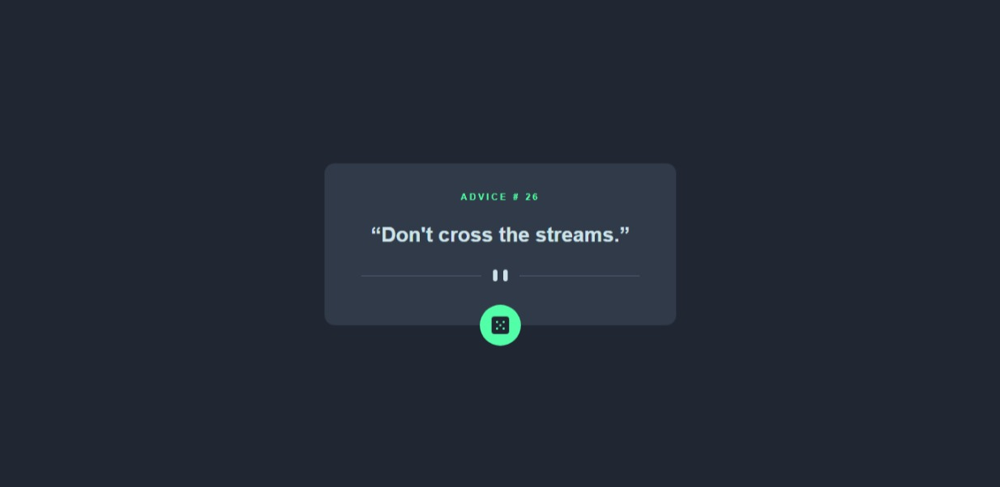

### The challenge

Users should be able to:

- Click the button and generate an advice

### Screenshot



### Links

- Solution URL: [Repository](https://github.com/afbly/advice-generator)
- Live Site URL: [Live Site](https://afbly.github.io/advice-generator/)

## My process

### Built with

- Semantic HTML5 markup
- CSS custom properties with Sass
- FetchAPI

### What I learned

I learned how to use FetchAPI to connect to Advice Slip API.
This is the code I used to get the advice from the API.

```js
function get_advice() {
  fetch('https://api.adviceslip.com/advice').then(response => {
    return response.json();
  }).then(advice_data => {
    const ADVICE_OBJ = advice_data.slip;
    text.innerHTML = "“" + ADVICE_OBJ.advice + "”";
    id.innerHTML = ADVICE_OBJ.id;
  }).catch(error => {
    console.log(error);
  })
}
```

